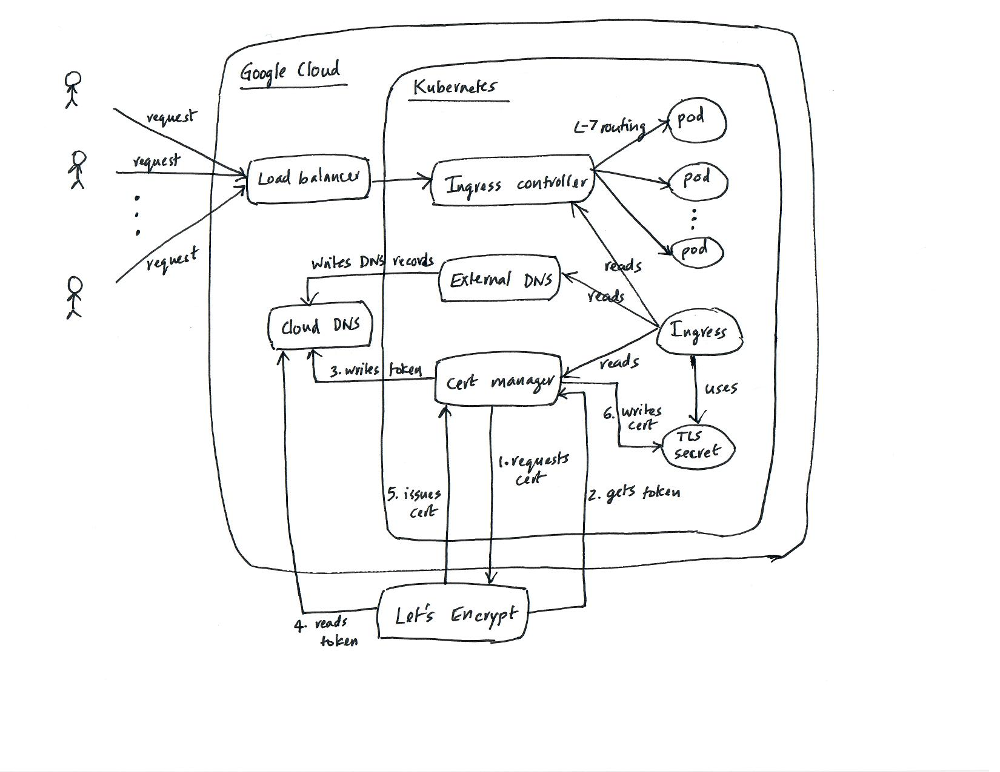

# API infrastructure service architecture

The API infrastructure service runs on `Kubernetes`. It consists of 3 services running in the cluster:

- kong-ingress-controller
- external-dns
- cert-manager

In addition, a `ClusterIssuer` custom resource is configured to automatically get certificates issued and renewed from 
`Let's Encrypt` using the ACME protocol. 

On the `Google Cloud` side, it uses `Cloud DNS` and `Load Balancer` services. Entry into a service starts at the `Load 
Balancer`, which is automatically provisioned when the `kong-ingress-controller` chart is installed.

## Architecture

## PKI and certificate management

