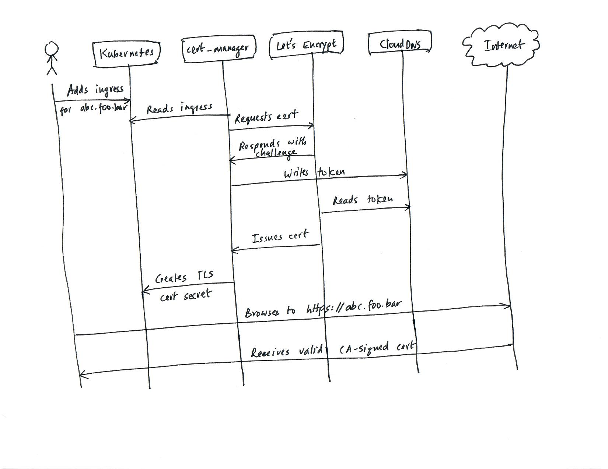

# API infrastructure service architecture

The API infrastructure service runs on `Kubernetes`. It consists of 3 services running in the cluster:

- kong-ingress-controller
- external-dns
- cert-manager

In addition, a `ClusterIssuer` custom resource is configured to automatically get certificates issued and renewed from 
`Let's Encrypt` using the ACME protocol. 

On the `Google Cloud` side, it uses `Cloud DNS` and `Load Balancer` services. Entry into a service starts at the `Load 
Balancer`, which is automatically provisioned when the `kong-ingress-controller` chart is installed.

## Architecture

The `ingress-controller`, `external-dns` and `cert-manager` resources all monitor `ingress` resources added to the 
cluster. 

- The `ingress-controller` service configures the load balancer and provides layer-7 routing to the backend services 
  as specified in the ingress definition.
- The `external-dns` service adds DNS A records for the hosts in the ingress resources onto the `Cloud DNS` zone. 
  It maps the DNS names to the external IP address of the load balancer.
- The `cert-manager` service obtains valid CA certificates from `Let's Encrypt` for the hosts in the ingress 
  resources using the ACME protocol.

## PKI and certificate management

The following sequence diagram shows how `cert-manager` interacts with `Let's Encrypt` to automatically get 
certificates issued for the endpoints in the ingress resources. 

